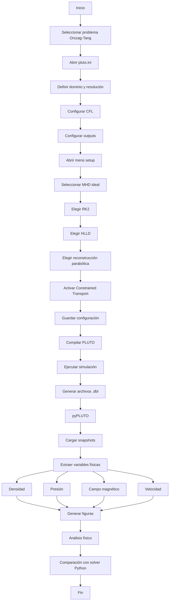

```mermaid
flowchart TD

A[Inicio] --> B[Seleccionar problema Orszag-Tang]

B --> C[Abrir pluto.ini]

C --> D[Definir dominio y resolución]
D --> E[Configurar CFL]
E --> F[Configurar outputs]

F --> G[Abrir menú setup]

G --> H[Seleccionar MHD ideal]
H --> I[Elegir RK2]
I --> J[Elegir HLLD]
J --> K[Elegir reconstrucción parabólica]
K --> L[Activar Constrained Transport]

L --> M[Guardar configuración]

M --> N[Compilar PLUTO]

N --> O[Ejecutar simulación]

O --> P[Generar archivos .dbl]

P --> Q[pyPLUTO]

Q --> R[Cargar snapshots]

R --> S[Extraer variables físicas]

S --> T[Densidad]
S --> U[Presión]
S --> V[Campo magnético]
S --> W[Velocidad]

T --> X[Generar figuras]
U --> X
V --> X
W --> X

X --> Y[Análisis físico]

Y --> Z[Comparación con solver Python]

Z --> AA[Fin]
```