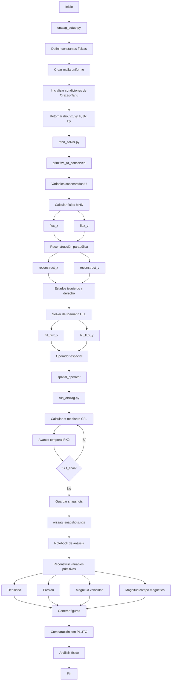

```mermaid
flowchart TD

A[Inicio] --> B[orszag_setup.py]

B --> C[Definir constantes físicas]
C --> D[Crear malla uniforme]
D --> E[Inicializar condiciones de Orszag-Tang]
E --> F[Retornar rho, vx, vy, P, Bx, By]

F --> G[mhd_solver.py]

G --> H[primitive_to_conserved]
H --> I[Variables conservadas U]

I --> J[Calcular flujos MHD]

J --> K[flux_x]
J --> L[flux_y]

K --> M[Reconstrucción parabólica]
L --> M

M --> N[reconstruct_x]
M --> O[reconstruct_y]

N --> P[Estados izquierdo y derecho]
O --> P

P --> Q[Solver de Riemann HLL]

Q --> R[hll_flux_x]
Q --> S[hll_flux_y]

R --> T[Operador espacial]
S --> T

T --> U[spatial_operator]

U --> V[run_orszag.py]

V --> W[Calcular dt mediante CFL]
W --> X[Avance temporal RK2]

X --> Y{t < t_final?}

Y -->|Sí| W
Y -->|No| Z[Guardar snapshots]

Z --> AA[orszag_snapshots.npz]

AA --> AB[Notebook de análisis]

AB --> AC[Reconstruir variables primitivas]

AC --> AD[Densidad]
AC --> AE[Presión]
AC --> AF[Magnitud velocidad]
AC --> AG[Magnitud campo magnético]

AD --> AH[Generar figuras]
AE --> AH
AF --> AH
AG --> AH

AH --> AI[Comparación con PLUTO]

AI --> AJ[Análisis físico]
AJ --> AK[Fin]
```